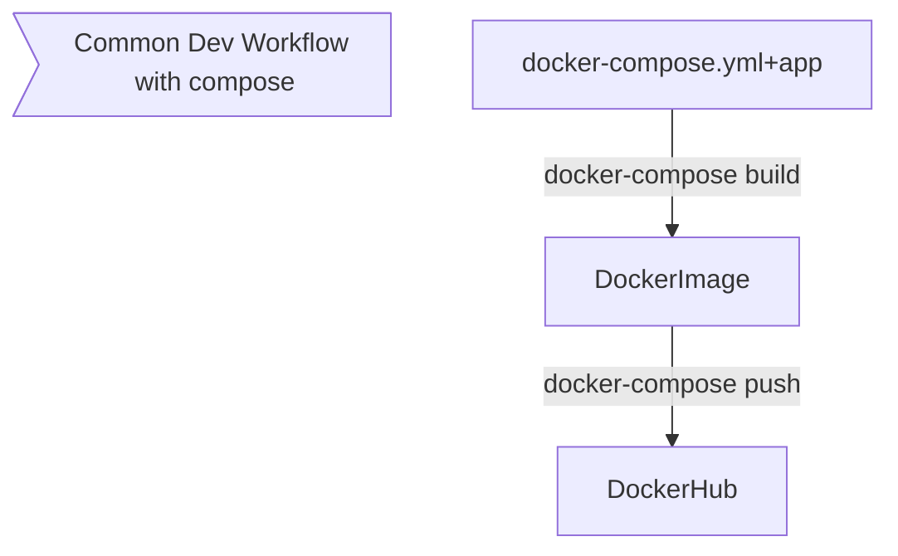

# [Docker Compose](https://docs.docker.com/compose/)
to start using this project make sure you follow up the .env.example fill it with your own variables

```bash
cp .env.example .env
```

## Local Development - Hot Reload

```bash
docker-compose -f docker-compose.yml  -f compose/docker-compose-hotreload.yml config


docker-compose -f docker-compose.yml  -f compose/docker-compose-hotreload.yml up
```

## Workflow




### Template docker-compose.yml file

```bash
docker-compose config
```

### Build
```bash
# build and up
docker-compose -f docker-compose.yml -f docker-compose-build.yml up --build
# only build
docker-compose -f docker-compose.yml -f docker-compose-build.yml build
# push it
docker-compose -f docker-compose.yml -f docker-compose-build.yml push
```

### Start
```bash
docker-compose up
```

### Check the default/created network

```bash

docker network ls

docker network inspect $(docker network ls --format "{{.Name}}" --filter name=compose)
```


### docker-compose useful commands

```bash
# running containers
docker-compose ps

# running processes in containers
docker-compose top

# logs
docker-compose logs

```

